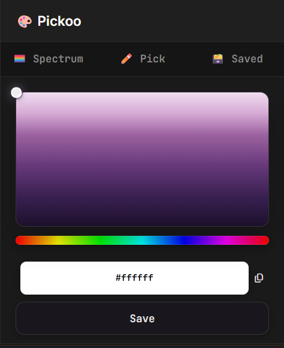
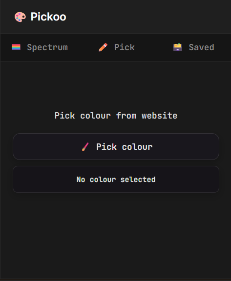
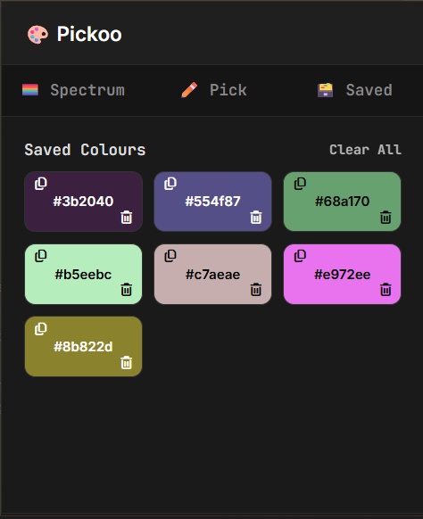

# 🎨 Pickoo

A lightweight Chrome extension for picking, converting, and saving colours — built with vanilla HTML, CSS, and JavaScript, no frameworks or build tools.


## Why this project

I built Pickoo as a deliberate JavaScript refresher — DOM manipulation, event handling, `async`/`await`, the Clipboard and EyeDropper Web APIs, and the `chrome.storage` API — with zero frameworks, right before starting React. The goal was to get the fundamentals solid so the jump into component-based UI has a real foundation under it.

## Features

- **🏳️‍🌈 Spectrum picker** — drag across an HSL colour field and hue slider for a live HEX preview
- **✏️ Eyedropper** — sample any colour from anywhere on screen using the native [`EyeDropper` API](https://developer.mozilla.org/en-US/docs/Web/API/EyeDropper)
- **🗃️ Saved palette** — save colours to a persistent gallery (`chrome.storage.local`), copy or delete them individually, or clear all at once
- **One-click copy** — copy any HEX code to the clipboard instantly
- Fully offline and dependency-free (Google Fonts / Font Awesome are loaded from CDN for styling only)


## Demo

[▶️ Watch Pickoo Demo](video.mp4)

## Screenshots






## Tech stack

| Layer      | Details                                                                           |
|------------|-----------------------------------------------------------------------------------|
| Structure  | HTML5                                                                             |
| Styling    | CSS3 (custom flex/grid layouts, no framework)                                     |
| Logic      | Vanilla JavaScript (ES6+), DOM APIs, `chrome.storage`, `EyeDropper`, `Clipboard`  |
| Platform   | Chrome Extension, Manifest V3                                                     |

## Installation (load unpacked)

1. Clone the repo:
   ```bash
   git clone https://github.com/nawshcode/pickoo.git
   ```
2. Open `chrome://extensions` in Chrome.
3. Enable **Developer mode** (top-right toggle).
4. Click **Load unpacked** and select the `pickoo` folder.
5. Pin the extension from the toolbar puzzle-piece icon for quick access.

## Project structure

```
pickoo/
├── icons/
│   ├── icon16.png
│   ├── icon32.png
│   ├── icon48.png
│   └── icon128.png
├── extension.html      # Popup UI
├── extension.js        # All popup logic (tabs, colour math, storage, eyedropper)
├── styles.css           # Popup styling
├── manifest.json        # Manifest V3 config
├── LICENSE
└── README.md
```

## Permissions

Pickoo only requests `storage`, used to persist your saved colour palette locally via `chrome.storage.local`. It does not read or modify page content, so it needs no host permissions.

## Roadmap

- [ ] Additional colour formats (RGB, HSL, CMYK) alongside HEX
- [ ] Export saved palette as JSON or CSS custom properties
- [ ] Keyboard shortcuts for pick/save/copy
- [ ] Firefox port (WebExtensions API)

## License

Licensed under the [MIT License](LICENSE).
